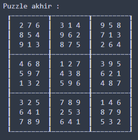

# Sudoku Solver
## Latar Belakang
Anda adalah Mr. Khun, saat ini Anda tergabung bersama tim Sweet & Sour untuk mencapai puncak menara. Agar dapat mencapai puncak menara, ada harus melalui serangkaian tes untuk dapat naik ke lantai selanjutnya. Saat ini Anda berada di lantai 18 dan administrator lantai tersebut, yaitu Mr. Le Leo ingin sekali menguji kecerdasan tim Anda dalam membuat strategi. Area permainan pada lantai ini dibagi menjadi 81 area, berbentuk seperti matriks berukuran 9x9. Setiap area ditandai dengan angka, dalam satu kolom maupun satu baris tidak boleh ada angka berulang (seperti pada permainan sudoku). Untuk lolos dari tes ini, tim Anda harus mengumpulkan kristal yang ada pada area bernomor 5. Anda yang bertugas sebagai light bearer (bertugas mengawasi seluruh area permainan dan memberikan petunjuk serta menyusun strategi untuk seluruh anggota tim). Anda bisa berkomunikasi dengan seluruh anggota dan melihat seluruh area permainan melalui lighthouse, tugas Anda adalah mencari tahu nomor untuk semua area permainan dan memberitahukan koordinat (x,y) area-area yang ditandai dengan nomor 5 kepada anggota tim Anda.

## Strategi Pencarian Solusi
Sudoku adalah sebuah persoalan NP-Complete, jadi belum diketahui apakah ada algoritma yang dapat menyelesaikan persoalan sudoku dalam kompleksitas waktu polinomial. Untuk sebuah persoalan sudoku ini berarti lama waktu rata rata untuk menyelesaikan sebuah persoalan sudoku menggunakan algorittma brute-force adalah O(k^n) dimana k = 9 dan n = 81, atau sekitar 2^1077. Algoritma yang pallin efisien yang diketahui adalah O(n^(n^2)) (sumber : http://www.norvig.com/sudoku.html) atau sekitar 2^1026 yakni menggunakan algoritma Backtracking.

Pada penyelesaian persoalan sudoku ini digunakan algoritma Backtracking. Menurut artikel diatas, algoritma Backtracking dinilai paling efektif dalam menyelesaikan persoalan sudoku. Algoritma Backtracking lebih cepat dalam melakukan pencarian solusi dibanding algoritma Brute Force. Hal ini karena pada algoritma Backtracking, untuk setiap sel yang belum terisi, pencarian dilakukan dengan menelusuri simpul yang berkemungkinan menghasilkan solusi. Ketika solusi yang ditelusuri bukan merupakan hasil yang benar, algoritma Backtracking akan *Backtrack* dan mencoba solusi lain, hal ini akan dilakukan terus menerus hingga solusi ditemukan.

## Getting Started
### Prerequisites
Berikut ini adalah persiapan environment yang dibutuhkan untuk menjalankan aplikasi.
- **Python** 3.x.x : https://www.python.org/downloads/
- **Pillow (PIL)** untuk pemrosesan gambar menjadi matriks `pip install pillow`
- **Pytesseract** untuk pengekstrakan data dari gambar : https://github.com/UB-Mannheim/tesseract/wiki dan `pip install pytesseract`
    - Pada source code sudoku.py, ubah path 
        ```
        tesseract.pytesseract.tesseract_cmd = r'C:/Program Files (x86)/Tesseract-OCR/tesseract.exe'
        ```
      menjadi path dari tesseract sesuai dengan lokasi install tesseract pada PC yang digunakan.
- Untuk lebih memudahkan penggunaan pytesseract, masukkan directory pytesseract pada PC yang digunakan ke dalam PATH environment variables. Setelah itu cek apakah
  tesserract dapat dijalankan dengan command berikut `tesseract -v` pada command line seperti pada contoh dibawah ini

<p align="center">


## How to Run
1. Pastikan file yang akan diproses sudah terletak pada folder `./test`.
2. Untuk menjalankan program, pastikan command sudah berada dalam directory `./src`, lalu jalankan command sebagai berikut.
   ```
   python sudoku.py
   ```
3. Masukkan pilihan jenis file masukan (menggunakan gambar atau file txt).
4. Masukkan nomor file yang terdapat pada setelah jenis file, misalkan jika ingin memasukkan file `image1.png`, maka memasukkan angka 1, begitu pula jika file yang 
   dimasukkan adalah file .txt. Apabila ingin menambahkan test case baru, maka beri nama sesuai yang ada pada folder `./test`, misal `image5.png` atau `tc5.txt`.
5. Program akan menampilkan board sudoku yang dimasukkan seperti berikut. Tunggu beberapa saat untuk preprocessing gambar.

<p align="center">


6. Tunggu hingga sudoku berhasil diselesaikan seperti berikut.

<p align="center">


7. Solusi puzzle akan ditampilkan pada layar dan akan disimpan pada folder `./ans` dengan format file `[JENIS FILE][NOMOR TESTCASE]-ans.txt`
8. Apabila puzzle tidak bisa diselesaikan, maka akan muncul `Unsolvable pada layar`.

### Library Pengerjaan Bonus
Dalam pengerjaan bonus, berikut ini adalah beberapa library yang digunakan dalam menunjang pemrosesan gambar sudoku ke dalam program.
1. **Pyesseract**
    Library ini digunaan untuk mengekstrak data dari gambar menjadi string OCR.
    - Kelebihan :
      Penggunaannya mudah, cukup menggunakan method image_to_string, selain itu tesseract tidak memerlukan training untuk mengenali karakter pada gambar
    - Kekurangan :
      Kurang tepat dalam membaca sebuah gambar. Pada program yang dibuat masih memerlukan beberapa penyesuaian agar pembacaan string lebih tepat misalkan salah membaca angka 2 menjadi karakter ? dan salah membaca angka 8 menjadi karakter &.
2. **Pillow**
    Library ini digunakan untuk melakukan pemotongan gambar menjadi ukuran tertentu dan melakukan enhance pada gambar agar memudahkan pembacaan OCR (Optical Character Recognition).
    - Kelebihan :
      Memudahkan dalam melakukan cropping gambar secara otomatis pada program.
3. **OpeCV**
    Library ini digunakan untuk preprocessing gambar untuk memudahkan pembacaan.
    - Kelebihan :
      Mudah digunakan dan memiliki fitur yang cukup lengkap
4. **Numpy**
    Library ini digunakan untuk membuat matriks
    - Kelebihan :
      Memudahkan dalam melakukan operasi matriks

## Referensi
1. Solving Every Sudoku Puzzle : http://www.norvig.com/sudoku.html
2. https://techwithtim.net/tutorials/python-programming/sudoku-solver-backtracking/
3. Algoritma Runut-Balik (Backtracking): https://informatika.stei.itb.ac.id/~rinaldi.munir/Stmik/2017-2018/Algoritma-Runut-balik-(2018).pdf

## Author
**13518040 - Muhammad Farid Adilazuarda**